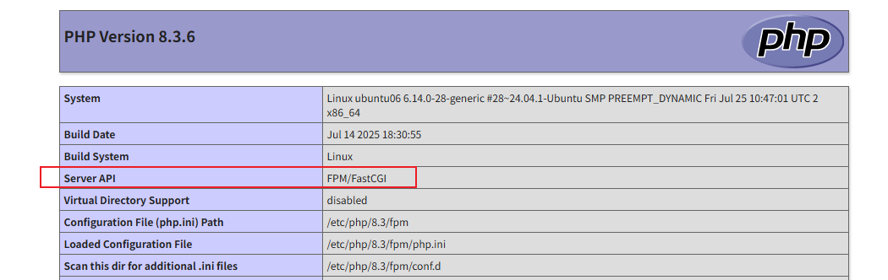

# 卸载 mod_php（推荐先停用）

```bash
# 停止 Apache
systemctl stop apache2

# 禁用 mod_php
a2dismod php8.3

# 重启 Apache
systemctl restart apache2
```

> 注意：Ubuntu 24.04 默认 PHP 是 8.3，请根据实际版本修改。

------

# 安装 PHP-FPM

```bash
apt update
apt install -y php8.3-fpm php8.3-mysql php8.3-mbstring php8.3-xml php8.3-curl
```

确认 PHP-FPM 正在运行：

```bash
systemctl status php8.3-fpm
```

你应该看到：

```
Active: active (running)
```

------

# 配置 Apache 支持 PHP-FPM

### 1️⃣ 启用必要模块

```bash
a2enmod proxy_fcgi setenvif
a2enconf php8.3-fpm
systemctl restart apache2
```

- `proxy_fcgi`：Apache 通过 FastCGI 代理请求给 PHP-FPM
- `setenvif`：设置环境变量
- `php8.3-fpm.conf`：系统默认配置 FastCGI handler

------

### 2️⃣ 修改虚拟主机（todo.conf）

编辑 `/etc/apache2/sites-available/todo.conf`：

```apache
<VirtualHost *:80>
    ServerName todo.local
    ServerAlias 192.168.73.6 localhost

    DocumentRoot /var/www/todo-app/public

    <Directory /var/www/todo-app/public>
        AllowOverride All
        Require all granted
    </Directory>

    # PHP-FPM 处理 .php 文件
    <FilesMatch \.php$>
        SetHandler "proxy:unix:/run/php/php8.3-fpm.sock|fcgi://localhost/"
    </FilesMatch>

    ErrorLog ${APACHE_LOG_DIR}/todo-error.log
    CustomLog ${APACHE_LOG_DIR}/todo-access.log combined
</VirtualHost>
```

关键点：

- `SetHandler "proxy:unix:/run/php/php8.3-fpm.sock|fcgi://localhost/"`
  告诉 Apache 用 PHP-FPM 处理 `.php` 文件
- DocumentRoot 仍然指向 `public/`

------

# 重启服务

```bash
systemctl reload apache2
systemctl restart php8.3-fpm
```

------

# 测试是否成功

1. 创建最小测试文件：

```bash
echo "<?php phpinfo();" > /var/www/todo-app/public/info.php
```

1. 浏览器访问：

```
http://192.168.73.6/info.php
```

你应该看到 PHP-FPM 信息（不是 mod_php），说明配置成功。



删除测试文件：

```bash
rm /var/www/todo-app/public/info.php
```

------

# 运行 todo-app

直接访问：

```
http://192.168.73.6
```

- 页面正常显示
- 数据库功能正常（确保 `config.php` 中 host=127.0.0.1, user=todo, pass=密码）

------

# 优化和注意事项

1. **权限**
   - PHP-FPM 以 `www-data` 用户运行
   - todo-app 目录权限必须对 `www-data` 可读写：

```bash
chown -R www-data:www-data /var/www/todo-app
chmod -R 755 /var/www/todo-app
```

1. **重载 PHP-FPM 后刷新 Apache 配置**
   每次修改 FPM 池配置：

```bash
systemctl reload php8.3-fpm
systemctl reload apache2
```

1. **并发与性能**
   - PHP-FPM 使用 pool 模型，可调 `pm.max_children`
   - Apache 可用 `event` MPM 支持高并发
